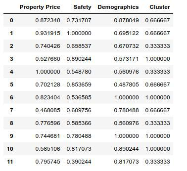

<h1>How to chose Berlin locality for the relocation</h1>

Work relocation is very complecated process. One of the key question is finding an apartment for the long-term rent.
It's very challenging to find an apartment in the unknown city in the shortest time. Especially if you don't know the local language and don't know the borough's features. 
My family is going to rellocate to Berlin (Germany) in the next year. I'm going to analyse Berlin boroughs to better understand, where (boroughs and neighborhods) I should search a flat for my family.

If you don't know the city, it's a real challenge to find the appropriate locality and appartment for affordable price. I prefer to plan such processes as relocation in advance to avoid some problems in the future, so I've decided to analyse Berlin localities and create a short list, while I'm still at home.

 My analysis may be devided on 2 blocks: locality level and borough level due to different level of details of the available information.

<h3> Locality level analysis</h3>
As you know, Berlin has 96 localities. I've downloaded the list of localities from Wikipedia and link the appropriate langitudes and latitudes using Nominatim. Then I've download 100 most popular venues using Forsquare API in the radius of 1500 m for each locality. I've reordered the dataset and used K-means clustering to devide localities in 4 groups. Below you can see the map with all clusters:

My choice wiyh short comments are shown below:

<h3> Borough level analysis</h3>
There are 12 boroughs in Berlin. 
For this analysis I've used PlaceILive ratings information, which looks like the following:

Each index is also explained on this site.
I've tried to find average rent prices, but several years ago there was a restructure reform in Germany, so the information about rent prices was either for the old boroughs or wasn't free to download. So as a compromise, I've used average property price for 1 sq.m. as a basis of rent price differentiation.
Also, I've used migrants information, provided by Wikipedia, to chose boroughs with a closer mentality.
Note! All sources links you may find in the full report, if it's needed.
Aftercombining all factors, I've realized, that the cluster analysis should be implemented using only several factors. I've decided not to use factors, which are subjective, not enough differentiated or which were taken to the consideration at the locality level analysis. 
The final set of factors for clusterization was the following (it's normalized data):

On the borough level I've had 3 clusters I've obtained from K-means clustering:
<ul>
	<li>0 cluster - good level of safety, but demographics level is average.</li>
	<li>1 cluster - average level of safety, but demographics level is enough high.</li>
	<li>2 cluster - the last group isn't convenient for us, due to there is a low level of safety, property isn't cheap.
</ul>
This clusterization hasn't fully met my expectations. So I've decided to create my own clusterization based on the above mentioned.
The highest group (mark 3) is a safety group with average property prices.
Average group (mark 2) is also a safe group, but either price is too high, or mentality index is zero.
Low group (mark 1) is the 2 group without any changes. It's not a safe group with zero mentality index.
This is the final table of boroughs clusters:

<h3> Combining results</h3>
Then I've combined results and here you can see the resulted map, where yellow circles on a deep green background are preferable localities for my family, the second priority is yellow circles on the light green background. To visualize I've used Folium package (Choropleth map to show the priority of boroughs as well as mark localities clusters). 

The final table is available in the code file.

<h3>Limitations of this analysis</h3> 
This analysis isn't an ultimate truth and the real life will make own changes. This analysis will be updated when we'll know the actual place of work. Also due to the Berlin rent market is the market of hosts, not clients, we'll have to find the appropriate flat not only according to our own expectations but proposals as well. Also, quality index information isn't the objective data, it may be helpful on the initial stage, but the real experience with the city will allow to chose the localities more wisely. Anyway I hope that this analysis aloows me to chose the optimal varient for my future flat.
